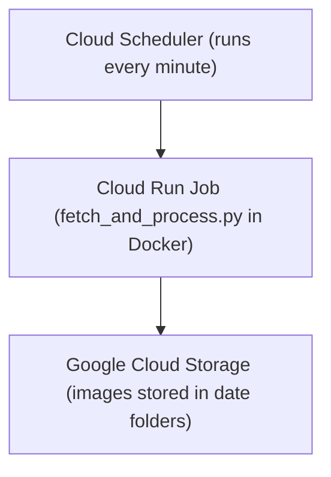

# iom-by-webcam

This project powers the [Isle of Man by Webcam](https://www.youtube.com/@IsleOfManByWebcam/videos) YouTube channel. It automates the capture of webcam images, stores them in Google Cloud Storage, and is being expanded to generate and upload videos to YouTube.

This repository represents a migration from an on-premises, manually managed setup to a modern, cloud-native architecture using Google Cloud Platform and GitHub Actions.

---

## Problem Statement

The original on-premises system relied on:

- A physical Windows server.
- PowerShell scripts triggered by Task Scheduler.
- External hard drives for storage.

### Limitations:
- **No remote access or observability**
- **Manual maintenance of scripts and storage**
- **Limited fault tolerance or scalability**
- **No CI/CD or source control integration**

To address these limitations, the system is being migrated to a cloud-based architecture that is fully automated, reproducible via infrastructure-as-code, and easy to maintain or extend.

---

## On-Prem Stack (Legacy)

| Component                 | Description                                          |
|---------------------------|------------------------------------------------------|
| PowerShell                | Automated webcam image capture                       |
| Windows Task Scheduler    | Scheduled image downloads                           |
| Windows Server            | Hosted the PowerShell scripts                        |
| External Hard Drive       | Local image storage                                  |
| Manual File Management    | No remote backup, aging scripts, and no CI/CD        |

---

## New Cloud-Based Stack

| Component            | Description                                                       |
|----------------------|-------------------------------------------------------------------|
| Python               | Image fetching and processing (`fetch_and_process.py`)            |
| Docker               | Containerized image processor                                     |
| Terraform            | Infrastructure as Code for provisioning on GCP                   |
| Cloud Run            | Executes the processor container on demand                       |
| Cloud Scheduler      | Triggers image capture every minute                              |
| Cloud Storage        | Stores images in daily timestamped folders                       |
| GitHub Actions       | Automates Docker build + Terraform deployments                   |

---

## Architecture Diagram


---

## Usage

### 1. Clone the Repo

```bash
git clone https://github.com/your-username/iom-by-webcam.git
cd iom-by-webcam
```
### 2. Develop Locally

```bash
cd image-processor
python3 -m venv venv
source venv/bin/activate
pip install -r requirements.txt
python fetch_and_process.py
```
Set the IMAGE_URL environment variable in .env or your shell.

### 3. Build and Test Docker

```bash
docker build -t image-processor .
docker run --rm -e IMAGE_URL="https://images.gov.im/webcams/bungalow1.jpg" -v "$(pwd)/output:/data/images" image-processor

```
### 4. Deploy to GCP with Terraform

```bash
cd infra
terraform init
terraform apply -var-file="terraform.tfvars"

```
Use terraform.tfvars.example to create your own terraform.tfvars.

### CI/CD

#### Image Processor Workflow:
1. Push to `image-processor/` directory
2. GitHub Actions workflow runs:
   - Builds the Docker image
   - Pushes it to **Google Artifact Registry**
   - Triggers Cloud Run update with the new image

#### Infrastructure Workflow:
1. Push to `infra/` directory
2. GitHub Actions workflow runs:
   - Runs `terraform plan` to preview changes
   - Optionally runs `terraform apply` to apply changes
   - Manages:
     - Cloud Run service
     - Cloud Scheduler
     - Cloud Storage
     - Service accounts and secrets
---

### GitHub Secrets Required

| Secret Name    | Description                                                  |
|----------------|--------------------------------------------------------------|
| `GCP_SA_KEY`   | GCP service account JSON credentials (base64-encoded or raw) |
| `PROJECT_ID`   | Your Google Cloud project ID (e.g., `isleofmanbywebcam`)     |
| `REGION`       | Deployment region (e.g., `europe-west1`)                     |
| `BUCKET_NAME`  | Name of the GCS bucket used to store images                  |

---

Secrets Required in GitHub:

GCP_SA_KEY → your GCP service account credentials JSON

Work still to be done

- [] Commit the Actions config.
- [] Schedule the video creation and upload to youtube.

