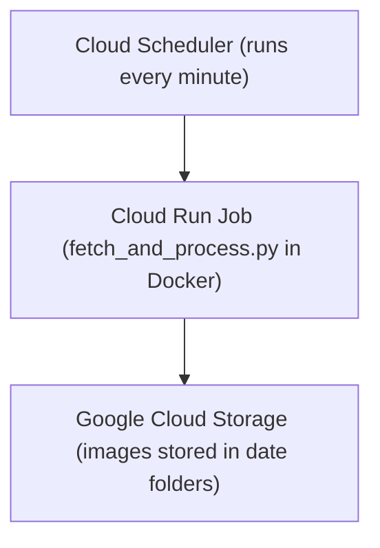

# iom-by-webcam

This project powers the [Isle of Man by Webcam](https://www.youtube.com/@IsleOfManByWebcam/videos) YouTube channel. It automates image capture from a public webcam, processes the images into timestamped collections, and can optionally upload or assemble them into videos.

It is the result of migrating from a previously physical, on-premises setup to a modern, cloud-based, fully automated infrastructure.

---

## Tech Stack

| Component            | Description                                                       |
|----------------------|-------------------------------------------------------------------|
| **Python**           | Image processing and download automation (`fetch_and_process.py`) |
| **Docker**           | Containerized the processor to run anywhere                       |
| **Terraform**        | Infrastructure as Code (GCP provisioning)                         |
| **Cloud Run**        | Serverless hosting of the image processor                         |
| **Cloud Scheduler**  | Triggers the image processor on a fixed schedule                  |
| **Cloud Storage**    | Stores downloaded webcam images securely                          |
| **GitHub Actions**   | CI/CD pipeline for Docker image and infrastructure deployment     |

---
Diagram created by mermaid (Diagrams via code).

---

## Usage

### 1. Clone the Repo

```bash
git clone https://github.com/your-username/iom-by-webcam.git
cd iom-by-webcam
```
### 2. Develop Locally
```bash
cd image-processor
python3 -m venv venv
source venv/bin/activate
pip install -r requirements.txt
python fetch_and_process.py
```
Set the IMAGE_URL environment variable in .env or your shell.

### 3. Build and Test Docker
```bash
docker build -t image-processor .
docker run --rm -e IMAGE_URL="https://images.gov.im/webcams/bungalow1.jpg" -v "$(pwd)/output:/data/images" image-processor

```
### 4. Deploy to GCP with Terraform
```bash
cd infra
terraform init
terraform apply -var-file="terraform.tfvars"

```
Use terraform.tfvars.example to create your own terraform.tfvars.


Work still to be done

Schedule the video creation and upload to youtube.